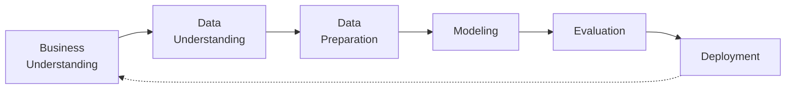

# 🏦 Bank Customer Churn Tahmin Sistemi — YBS3259 Final Projesi


Banka müşterilerinden hangilerinin **ayrılma (churn)** riski taşıdığını tahmin eden, uçtan uca **CRISP-DM** metodolojisiyle yürütülen makine öğrenmesi projesi. Yeni müşteri kazanmanın, mevcut müşteriyi elde tutmaktan 5-7 kat daha maliyetli olduğu gerçeğiyle, projenin temel amacı **ayrılma riski yüksek müşterileri önceden tespit edip** doğru zamanda elde tutma (retention) kampanyaları sunabilmektir.

**Problem Tipi:** Binary Classification (İkili Sınıflandırma)  
**Hedef Değişken:** `Exited` (1 = Müşteri ayrıldı, 0 = Kaldı)  
**Veri Seti Boyutu:** 10.000 Gözlem, 14 Değişken  
**Sınıf Dağılımı:** Dengesiz (~%20 Churn Oranı)

---

## 🚀 Proje Çıktıları ve Öne Çıkan Özellikler

- **Gelişmiş Keşifsel Veri Analizi (EDA):** Veri seti üzerinde 7 aşamalı detaylı analiz yapılmış, 10 temel içgörü ve risk faktörü çıkarılmıştır.
- **Özellik Mühendisliği (Feature Engineering):** Doğrusal olmayan ilişkileri modele tanıtmak için `is_high_products_risk` (3-4 ürün sahipliği) ve `has_zero_balance` gibi veri sızıntısı barındırmayan türetilmiş öznitelikler geliştirilmiştir.
- **Çok Kriterli Model Karşılaştırması:** 12 farklı sınıflandırma algoritması aynı çapraz doğrulama (CV) stratejisiyle test edilmiş, **Logistic Regression (class_weight='balanced')** çok kriterli yaklaşımla (F1, Recall, ROC-AUC ve kararlılık) final model seçilmiştir.
- **HCI Odaklı Web Uygulaması:** Ben Shneiderman'ın 8 Altın Kuralı ve Nielsen Kullanılabilirlik İlkeleri'ne uygun olarak tekil ve toplu tahmin yapabilen profesyonel bir Streamlit arayüzü inşa edilmiştir.

---

## 🔍 Kritik Veri İçgörüleri (EDA Bulguları)

Veri seti üzerinden elde edilen ve modellemeye de yön veren en çarpıcı iş sonuçları şunlardır:
* 🎂 **Yaş (Age):** Churn'ün en güçlü belirleyicisidir. Yaş arttıkça ayrılma riski monoton olarak artar. (Örn: 46-55 yaş grubunda %30, 65+ grupta %60 churn).
* ✅ **Aktiflik (IsActiveMember):** Pasif üyelerin churn oranı (%27.5), aktif üyelere kıyasla neredeyse **2 kat daha fazladır**.
* 🌍 **Coğrafya (Geography):** Almanya pazarında (%28.8), Fransa ve İspanya'ya göre belirgin bir sistemik churn riski gözlemlenmiştir. Pasif Alman müşterilerde churn oranı %38.4'lere fırlamaktadır.
* 📦 **Ürün Sayısı (NumOfProducts):** 3 veya 4 ürünü olan müşterilerde churn oranı dramatik şekilde yüksektir (%60+), ürün paketleme stratejilerinin gözden geçirilmesi gereklidir.

---

## 🤖 Model Performansı

Verideki sınıf dengesizliği (%80'e %20) sebebiyle geleneksel `Accuracy` yerine `F1` ve `Recall` metrikleri önceliklendirilmiştir. "Ayrılacak bir müşteriyi kaçırmamanın maliyeti", "kalacak bir müşteriye kampanya yapmanın maliyetinden" daha yüksek olarak kabul edildiğinden **Recall bilerek yüksek tutulmuştur**.

| Model | F1 Score | Recall (Hassasiyet) | ROC-AUC | Accuracy | Overfit Gap (Eğitim Farkı) |
|---|---|---|---|---|---|
| **Logistic Regression** (Seçilen) | **0.4866** | **0.6716** | **0.7629** | 0.7130 | 0.0103 |

> Modelin Overfit (Aşırı öğrenme) farkı sadece **0.0103**'tür. Bu da modelin canlı ortamda (production) oldukça stabil ve sürdürülebilir bir performans sergileyeceğinin en büyük kanıtıdır.

---

## 💻 Web Uygulaması (Streamlit Deployment)

Modelin iş birimlerince kullanılabilmesi için profesyonel bir yönetim paneli (dashboard) geliştirilmiştir:
1. **Tekil Tahmin:** Manuel müşteri girişi ile riskin hesaplanması, Gauge grafikleriyle güven skorunun (confidence) sunulması ve kural bazlı eylem önerisi verilmesi.
2. **Toplu Tahmin (CSV):** Binlerce müşteriyi içeren CSV dosyasının yüklenerek batch tahmin yapılması. Hatalı sütun/veri tipi kontrolleri yapıldıktan sonra sonuçların grafiklerle özetlenip tablo olarak indirilmesi.
3. **Model Performans Ekranı:** Modelin ROC, Confusion Matrix ve liderlik metriklerinin şeffaf şekilde iş birimlerine gösterilmesi.
4. **Monitoring:** Yapılan tahminlerin `logs/prediction_log.csv` altına kaydedilmesi ve geçmişe dönük churn/güven dağılımının (Data Drift) izlenebilmesi.

---

## 📂 Proje Dizin Yapısı

```
churn-analysis/
├── data/
│   ├── raw/churn.csv              # Ham veri (10.000 satır)
│   ├── processed/                 # EDA çıktısı (temizlenmiş veri)
│   └── model_ready/               # Train/test split
├── scripts/                       # EDA, DataPrep, Model scriptleri
├── figures/                       # Grafikler (HTML + PNG)
├── reports/
│   ├── csv/                       # Analiz tabloları
│   └── markdown/                  # Raporlar + VERI_SOZLUGU.md
├── models/                        # Eğitilmiş modeller + pipeline
├── app/                           # Streamlit deployment
├── notebooks/                     # Jupyter notebook
├── .github/agents/                # Uzman ajan tanımları (hocadan)
├── requirements.txt
└── README.md
```

## CRISP-DM Akışı



## Kurulum

```bash
pip install -r requirements.txt
```

## Çalıştırma Sırası

1. **EDA:** `scripts/` içindeki keşif analizleri → `figures/` + `reports/`
2. **DataPrep:** temizleme, encoding, scaling, stratified split → `data/model_ready/` + `models/preprocessing_pipeline.pkl`
3. **Model:** 12 model karşılaştırması → `models/final_model.pkl`
4. **Deployment:** `streamlit run app/app.py`

## Veri Kaynağı

Veri seti, "Churn Modelling / Bank Customer Churn" (10.000 satır) şemasıyla birebir uyumludur.
Orijinal dosyayı kullanmak için aynı sütunlarla indirip `data/raw/churn.csv` ile değiştirin:

- https://github.com/Dhillipkumar/Bank-Churn-Prediction-Model/blob/main/Churn_Modelling.csv
- https://github.com/YBI-Foundation/Dataset/blob/main/Bank%20Churn%20Modelling.csv
